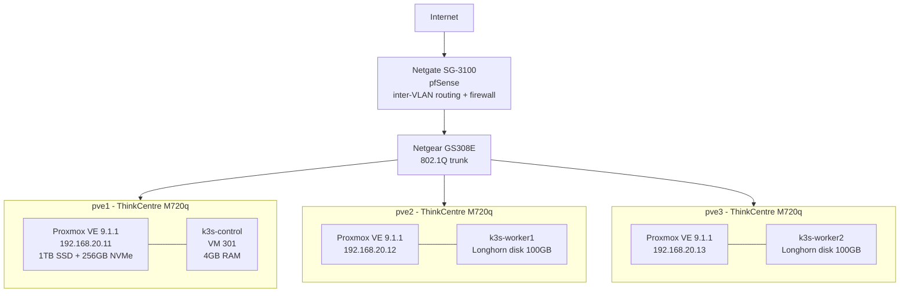
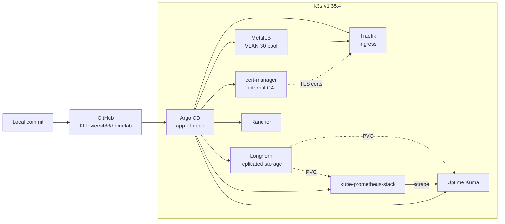
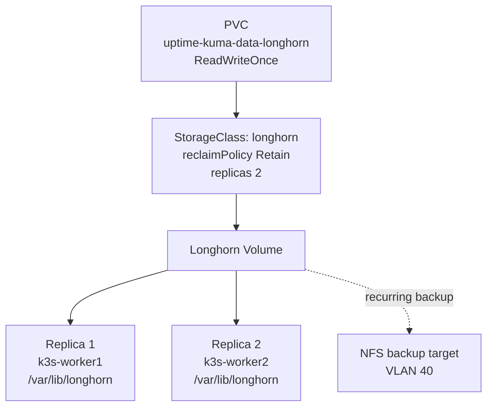

# Architecture

## Physical and network topology

## VLAN plan

| VLAN | Purpose | Subnet | Notes |
|------|---------|--------|-------|
| 10 | LAN / general devices | 192.168.10.0/24 | |
| 20 | Proxmox cluster | 192.168.20.0/24 | pve1 .11, pve2 .12, pve3 .13 |
| 30 | k3s services | 192.168.30.0/24 | MetalLB L2 pool |
| 40 | Storage / NAS | 192.168.40.0/24 | Longhorn backup target |
| 50 | Management | 192.168.50.0/24 | Switch and OOB access |

## Cluster and GitOps flow

## Storage layout

## Service endpoints

| Service | Host | Auth |
|---------|------|------|
| Rancher | rancher.home | Built-in |
| Uptime Kuma | uptime.home | Built-in |
| Longhorn | longhorn.home | Traefik basicAuth |
| Grafana | grafana.home | Built-in |
| Prometheus | prometheus.home | Traefik basicAuth |
| Alertmanager | alertmanager.home | Traefik basicAuth |
