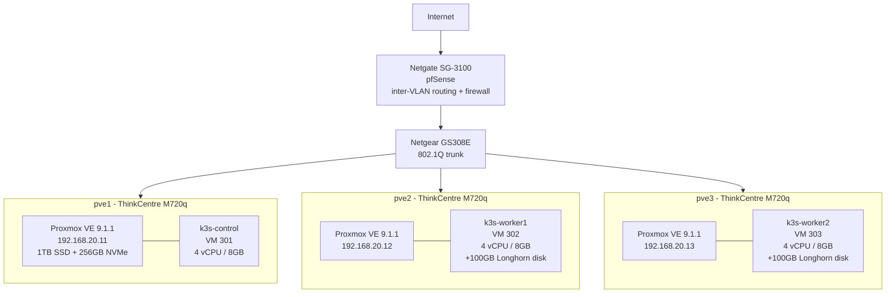
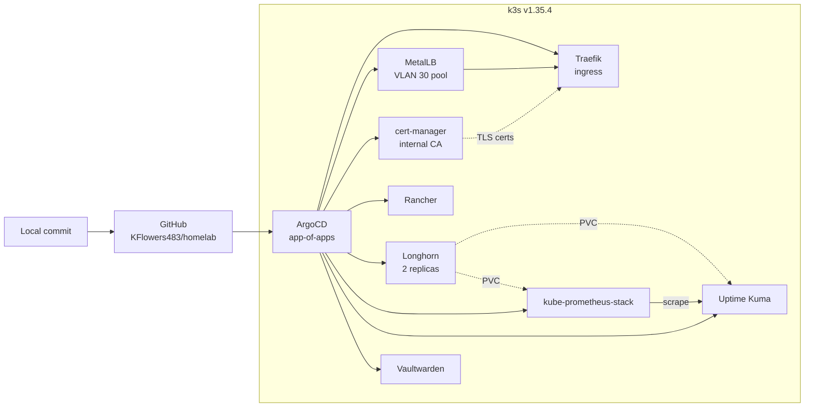
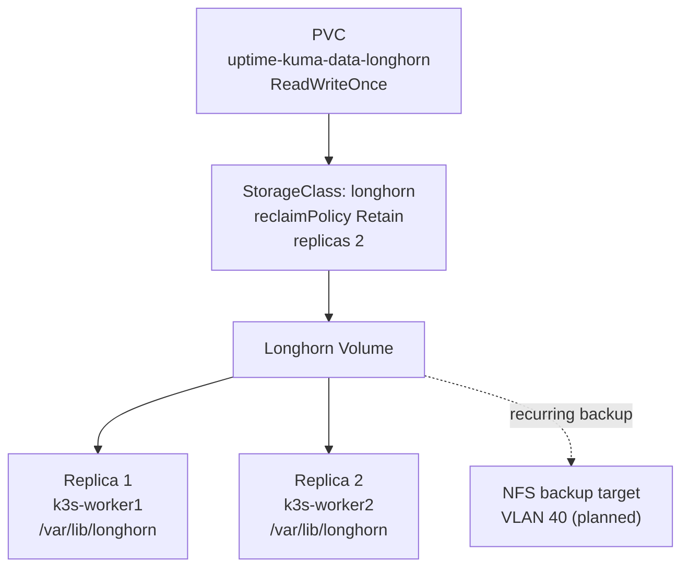

# Architecture

## Physical and network topology



## VLAN plan

| VLAN | Purpose | Subnet | Notes |
|------|---------|--------|-------|
| 10 | LAN / general devices | 192.168.10.0/24 | |
| 20 | Proxmox cluster | 192.168.20.0/24 | pve1 .11, pve2 .12, pve3 .13 |
| 30 | k3s nodes and services | 192.168.30.0/24 | nodes .21-.23, MetalLB pool .200-.220 |
| 40 | Storage / NAS | 192.168.40.0/24 | Longhorn backup target, planned |
| 50 | Management | 192.168.50.0/24 | Switch and OOB access |

## Cluster and GitOps flow



## Storage layout

Longhorn runs on the two workers only. The control plane is deliberately
excluded with `createDefaultDiskLabeledNodes: true` and no label, so etcd and
the API server never compete with replica traffic.



`local-path` is still the cluster default StorageClass. `longhorn` is opt-in
per PVC, so nothing lands on replicated storage by accident.

Each worker disk is 100GB, mounted at `/var/lib/longhorn` by UUID in
`/etc/fstab`. Longhorn reserves 25% of each, leaving roughly 70GB schedulable
per node.

## Service endpoints

| Service | Host | Auth | TLS |
|---------|------|------|-----|
| Rancher | rancher.home | Built-in | Rancher CA |
| Uptime Kuma | uptime.home | Built-in | no |
| Vaultwarden | vault.home | Built-in | homelab CA |
| Longhorn | longhorn.home | Traefik basicAuth | homelab CA |
| Grafana | grafana.home | Built-in | homelab CA |
| Prometheus | prometheus.home | Traefik basicAuth | homelab CA |
| Alertmanager | alertmanager.home | Traefik basicAuth | homelab CA |

## Host-level config not in Git

These are node changes with no manifest behind them. Ansible candidates.

Longhorn prerequisites, all three nodes:

```bash
dnf install -y iscsi-initiator-utils nfs-utils cryptsetup
systemctl enable --now iscsid
printf 'iscsi_tcp\ndm_crypt\n' > /etc/modules-load.d/longhorn.conf
```

firewalld rule for node-exporter, all three nodes. Without it Prometheus can
only scrape whichever node it happens to be running on:

```bash
firewall-cmd --permanent --add-rich-rule='rule family=ipv4 source address=192.168.30.0/24 port port=9100 protocol=tcp accept'
firewall-cmd --reload
```
