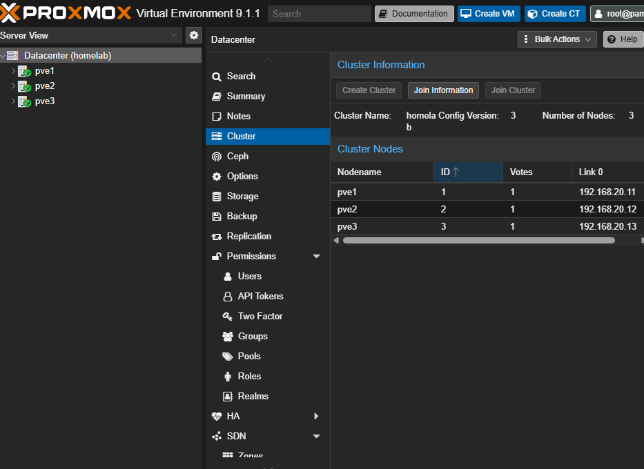

# Proxmox Cluster Setup

3-node Proxmox cluster running on Lenovo ThinkCentre M720q Tinys. 
Each node is on VLAN 20 with a VLAN-aware bridge for VM traffic.

## Nodes

| Node | Hostname | Storage |
|------|----------|---------|
| pve1 | pve1.homelab.local | 512GB NVMe + 1TB SSD |
| pve2 | pve2.homelab.local | 512GB NVMe |
| pve3 | pve3.homelab.local | 512GB NVMe |

## Cluster

- Cluster name: `homelab`
- Proxmox version: 9.1.1
- All nodes on VLAN 20

## Storage Pools

| Node | Pool Name | Size | Type |
|------|-----------|------|------|
| pve1 | data | 512GB | LVM-Thin (NVMe) |
| pve1 | data-ssd | 1TB | LVM-Thin (SSD) |
| pve2 | data | 512GB | LVM-Thin (NVMe) |
| pve3 | data | 512GB | LVM-Thin (NVMe) |

## Post-Install Config

- Switched from enterprise repo to no-subscription repo
- Removed subscription nag screen
- Set timezone to America/New_York
- Enabled VLAN aware on vmbr0 on all nodes

## Screenshot

